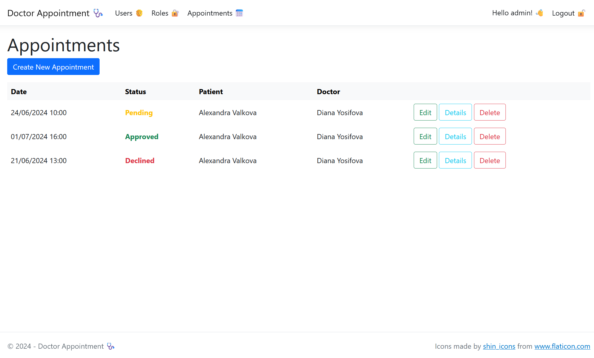
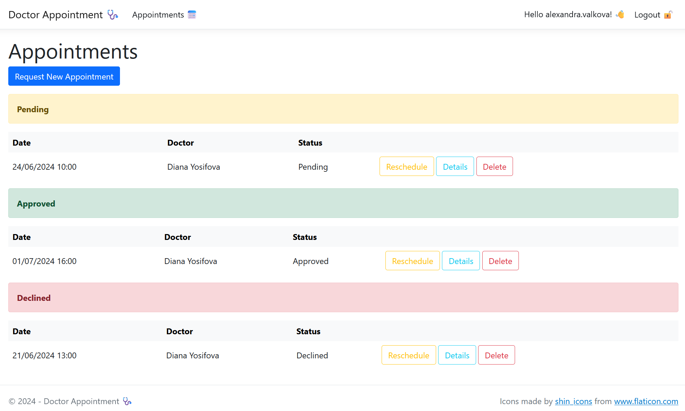
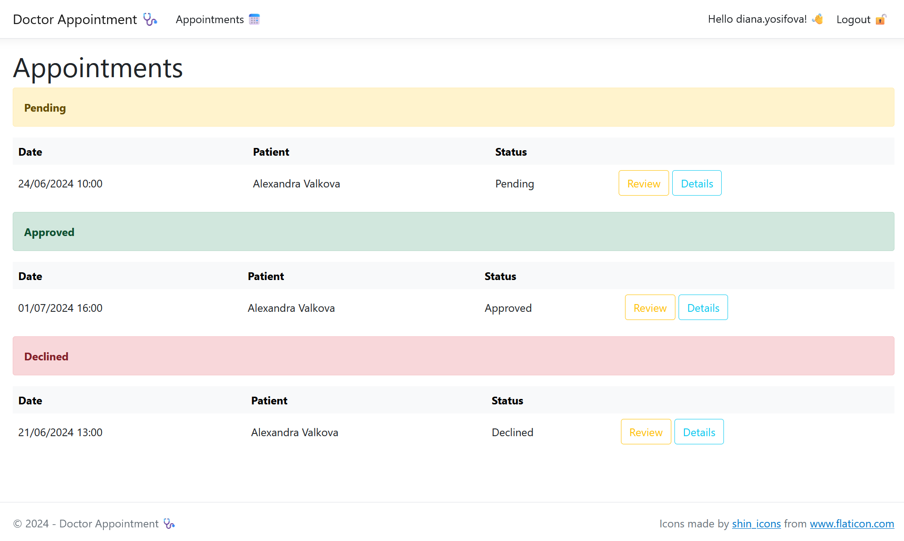

# Doctor Appointment 🩺
Online registry for patients who want to make an appointment with their doctor 🧑‍⚕️

This is an ongoing ASP.NET Core 8 project based on the old [Patient's Registry](https://github.com/alexandra-valkova/PatientsRegistry) project :octocat:

It implements the following ⬇️
- **Clean Architecture**;
- ASP.NET **Identity** Authentication and Role-Based Authorization;
- code-first approach with **SQL Server**, **EF Core**, Generic Repository and Specification Design Patterns;
- **Razor Pages** Web App;
- **Minimal Web API** with Bearer Token.

## Structure

### Core

- **Domain** - Entities (including _ASP.NET Identity_), Interfaces, _Result_ and _Specification_ Design Pattern;
- **Application** - services and use cases with _MediatR_ and _FluentValidation_, organized in a _Vertical Slice Architecture_ style (DTOs, Validators, Commands and Queries grouped by Features);

### Infrastructure
- **Persistence** - database access, in this case _SQL Server_ with _Entity Framework Core_ and _Generic Repository_ Design Pattern;

### Presentation
- **RazorPages** - a _Razor Pages_ app that consumes the services. It applies the full business functionality;
- **API** - an ASP.NET Core Web API (_Minimal API_ with _Swagger UI_) to access appointments information from the database, with _Bearer Token_ authorization;

## Functionality

The web application defines 3 user roles and supports adding and editing new roles by the admin:
- **Admin** - can access and edit all data (users, roles and appointments);
- **Patient** - can request, reschedule and delete apointments;
- **Doctor** - can approve or decline appointments;

Appointments have one of the following status: _Pending_, _Approved_ or _Declined_.

The API currently covers only the appointments data (GET, POST, PUT, PATCH, DELETE).

### Screenshots

	
View screenshots 📸 of the web app

- Admin ⚙️ Appointments Page

- Patient 🥼  Appointments Page

- Doctor 🩺 Appointments Page

